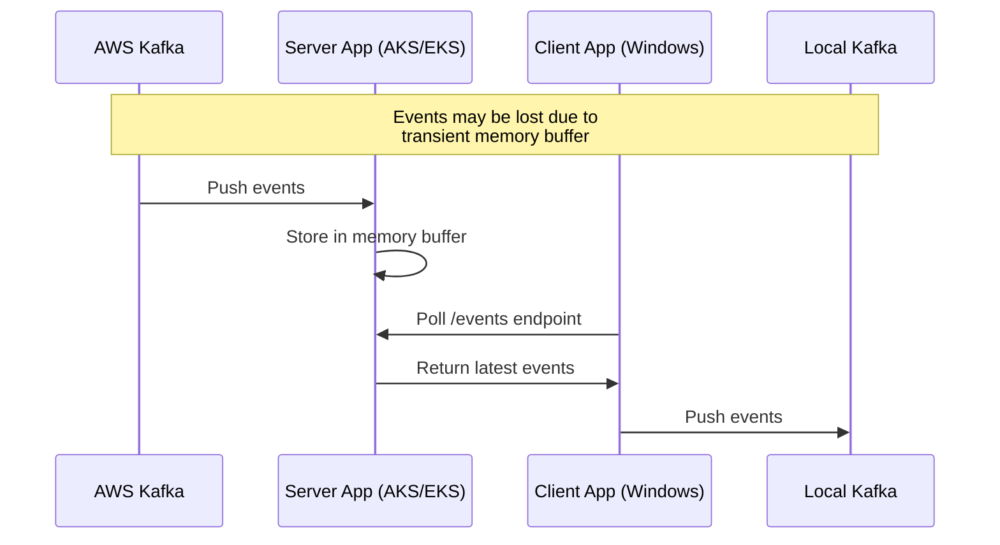

# Kafka Replicator

A solution for replicating events from a Kafka cluster in AWS to a local Kafka instance, using a server application running on AKS/EKS as an intermediary.

## Architecture



## Security Features

- API Key authentication for all endpoints
- CORS protection with configurable allowed origins
- Rate limiting (100 requests per 15 minutes per IP)
- Helmet security headers
- HTTPS enforcement through Istio
- Swagger documentation with API key authentication
- Health check endpoint for monitoring
- Prometheus metrics for observability

## Components

### Server Application
- Runs on AKS/EKS
- Connects to AWS Kafka cluster
- Stores latest events in memory
- Exposes REST API and Prometheus metrics
- Requires API key authentication
- Swagger documentation at `/api/v1/docs`
- Configurable API prefix (default: `/api/v1`)

### Client Application
- Runs on Windows laptop
- Polls server API at configurable intervals
- Pushes events to local Kafka instance
- Handles connection errors gracefully

## Setup Instructions

### Server Setup

1. Navigate to the server directory:
   ```bash
   cd server
   ```

2. Install dependencies:
   ```bash
   npm install
   ```

3. Generate an API key:
   ```bash
   npm run generate-api-key
   ```

4. Copy the environment file:
   ```bash
   cp .env.example .env
   ```

5. Update the `.env` file with your configuration:
   - Set the API key (use the generated one)
   - Configure Kafka broker and topic
   - Adjust port if needed
   - Set allowed origins
   - Configure API prefix if needed

6. Check for package updates:
   ```bash
   npm run check-updates
   ```

7. Update dependencies (if needed):
   ```bash
   npm run update-deps
   ```

8. Deploy to Kubernetes:
   ```bash
   # Create the secret
   kubectl create secret generic kafka-replicator-secrets --from-literal=api-key=your-api-key

   # Apply the deployment
   kubectl apply -f k8s/deployment.yaml

   # Apply Istio configurations
   kubectl apply -f k8s/istio-gateway.yaml
   kubectl apply -f k8s/istio-virtualservice.yaml
   kubectl apply -f k8s/istio-destinationrule.yaml
   ```

### Docker Deployment

1. Build the Docker image:
   ```bash
   npm run docker-build
   ```

2. Run the container locally (for testing):
   ```bash
   npm run docker-run
   ```

3. Push to container registry:
   ```bash
   # Tag the image
   docker tag kafka-replicator-server your-registry/kafka-replicator-server:latest

   # Push to registry
   docker push your-registry/kafka-replicator-server:latest
   ```

4. Update Kubernetes deployment to use the new image:
   ```bash
   kubectl set image deployment/kafka-replicator-server kafka-replicator-server=your-registry/kafka-replicator-server:latest
   ```

### Client Setup

1. Navigate to the client directory:
   ```bash
   cd client
   ```

2. Install dependencies:
   ```bash
   npm install
   ```

3. Copy the environment file:
   ```bash
   cp .env.example .env
   ```

4. Update the `.env` file with your configuration:
   - Set the server URL
   - Configure the API key
   - Set the Kafka topic

5. Run the client:
   ```bash
   node src/index.js --interval 1000
   ```

## API Documentation

The server exposes Swagger documentation at `/api/v1/docs`. The API includes:

- `GET /api/v1/health`: Health check endpoint
- `GET /api/v1/events`: Get latest Kafka events (requires API key)
- `GET /api/v1/metrics`: Prometheus metrics endpoint
- `GET /api/v1/docs`: Swagger documentation

## Testing with Postman

A Postman collection is provided in `postman/kafka-replicator.postman_collection.json`. To use it:

1. Import the collection into Postman
2. Set the following environment variables:
   - `base_url`: Your server URL
   - `api_key`: Your API key

## Prometheus Metrics

The server exposes the following metrics at `/api/v1/metrics`:

- `kafka_events_consumed_total`: Total number of events consumed from Kafka
- `api_requests_total`: Total number of requests to the `/events` endpoint
- `kafka_errors_total`: Total number of Kafka-related errors

Example metrics output:
```
# HELP kafka_events_consumed_total Total number of events consumed from Kafka
# TYPE kafka_events_consumed_total counter
kafka_events_consumed_total 42

# HELP api_requests_total Total number of requests to the /events endpoint
# TYPE api_requests_total counter
api_requests_total 15

# HELP kafka_errors_total Total number of Kafka-related errors
# TYPE kafka_errors_total counter
kafka_errors_total 0
```

## Docker Image Security

The Docker image is built with security best practices:
- Multi-stage build to minimize image size
- Non-root user for running the application
- Proper file permissions
- Health checks for container orchestration
- Minimal base image (Alpine Linux)
- Proper .dockerignore configuration

## Notes

- The server maintains a buffer of the last 10 events in memory
- Events may be lost if the buffer is full when new events arrive
- The client polls the server at a configurable interval (default: 1 second)
- Both applications use plaintext Kafka communication
- API key authentication is required for all server endpoints
- The API prefix is configurable (default: `/api/v1`)
- Istio configurations are provided for secure ingress
- Regular dependency updates are recommended using `npm run check-updates` 